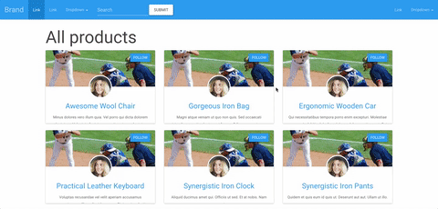

# README

A quick demo of how to style a Rails app using [Bootstrap](http://getbootstrap.com/), [Bootswatch](https://bootswatch.com/), and [Bootsnip](http://bootsnipp.com/).



Bootstrap was installed using the [bootstrap-sass gem](https://github.com/twbs/bootstrap-sass).
The app was styled using the Bootswatch [Paper](https://bootswatch.com/paper/) theme.
The index page was styled using this [eCommerce Product Detail](http://bootsnipp.com/snippets/featured/ecommerce-product-detail) snippet.
The show page was styled using this [Tumblr cards redesign concept](http://bootsnipp.com/snippets/featured/tumblr-cards-redesign-concept) snippet.

# INSTALLATION
```
rake db:create
rake db:migrate
rake db:seed
```
